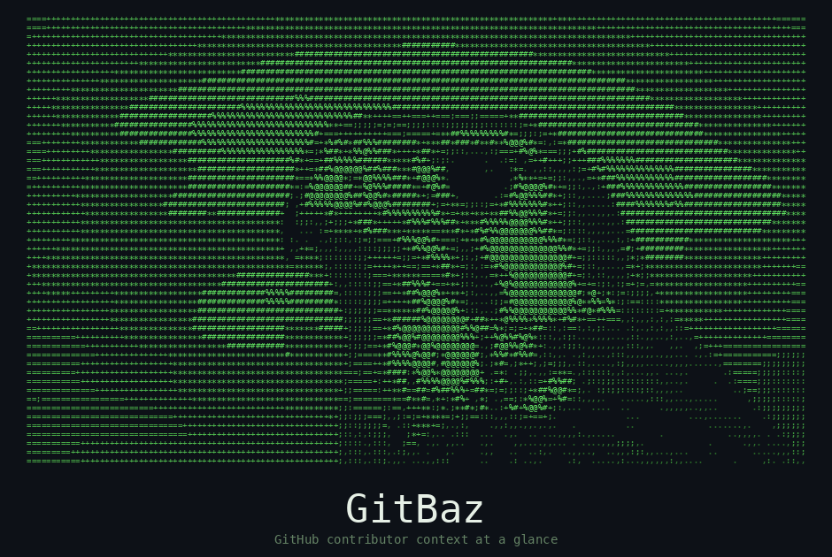

# GitBaz



GitHub contributor context at a glance.

> "Baz" means "falcon" in Kurdish, the animal with the sharpest eyesight.

## Features

- Contributor scoring (100-point scale across PRs, commits, merge rate, account age, followers)
- Tier system: Newcomer, Regular, Contributor, Trusted, Maintainer
- Badges: First-Timer, Issue Reporter, Sharp Eye, Prolific, Veteran, Popular, New Account
- Repo-specific scoring
- PR/Issue/Discussion context panels
- Bot detection
- AI-generated PR detection
- Repository health via OpenSSF Scorecard
- Activity heatmap and streaks
- Vouch integration (vouch/denounce/unvouch via VOUCHED.td)
- CLI + Chrome Extension

## Installation

### CLI

```bash
git clone https://github.com/happyhackingspace/gitbaz.git
cd gitbaz
bun install && bun run build

bunx gitbaz auth ghp_your_github_token
bunx gitbaz score octocat
bunx gitbaz score octocat --repo facebook/react
```

### Chrome Extension

1. `bun install && bun run build`
2. Open `chrome://extensions/`, enable Developer mode
3. Load unpacked -> `packages/extension/.output/chrome-mv3/`
4. Go to extension Options, enter your GitHub PAT
5. Navigate to any GitHub issue, PR, or discussion

## CLI Usage

```bash
gitbaz auth <token>                           # Store GitHub PAT
gitbaz auth --status                          # Check authentication
gitbaz auth --clear                           # Remove stored token

gitbaz score <username>                       # Global score
gitbaz score <username> --repo owner/repo     # Repo-specific score
gitbaz score <username> --format json         # JSON output
gitbaz score <username> --format minimal      # One-line output

gitbaz pr owner/repo#123                      # PR context
gitbaz issue owner/repo#456                   # Issue context
gitbaz discussion owner/repo#789              # Discussion context
gitbaz repo owner/repo                        # Repository context
gitbaz activity <username>                    # Activity heatmap

gitbaz cache clear                            # Clear cached data
gitbaz cache stats                            # Show cache size
```

## Scoring

| Component | Max Points | Measures |
|-----------|-----------|----------|
| In-repo PRs | 25 | Activity in the specific repository |
| Merge rate | 20 | Quality of contributions (merged/total) |
| Global PRs | 20 | Overall open-source experience |
| Commits (yr) | 15 | Recent activity level |
| Account age | 10 | Time on the platform |
| Followers | 10 | Community recognition |

When no repo context is provided, the 25 repo points redistribute to other components.

## Development

```bash
bun install          # Install dependencies
bun run build        # Build all packages
bun run test         # Run tests
bun run lint         # Lint check
bun run typecheck    # Type checking
```

### Structure

```
packages/
  core/       # Scoring, API client, types, cache interface
  cli/        # Commander.js CLI
  extension/  # WXT Chrome extension (Manifest V3)
```

## License

MIT - [Happy Hacking Space](https://github.com/happyhackingspace)
